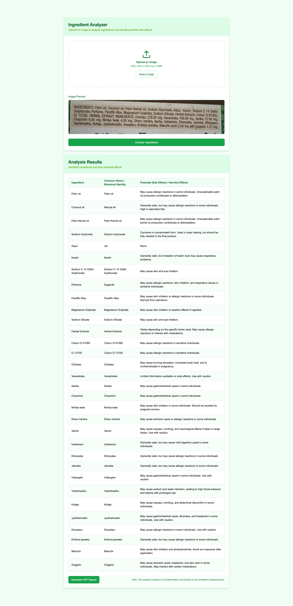

# Ingredient Analyzer Next.js App

This is a Next.js application that analyzes images of product ingredients using various AI models. The app allows users to upload an image of product ingredients and receive a detailed analysis of each ingredient, including its scientific name, common Indian name, and potential side effects. The results can be exported as PDF.

## Features

- Upload an image of product ingredients
- Analyze the image using different AI models
- Receive a JSON array of ingredients with detailed information

### Sample Output

<div align="center">
  <a href="sample/app_output.png" target="_blank">
    
    <br>
    <small>Click to view full image</small>
  </a>
</div>

<div align="center" style="margin-top: 20px;">
  <a href="sample/ingredient_analysis_sample.pdf" target="_blank" style="text-decoration: none;">
    <button style="background-color: #4F46E5; color: white; padding: 10px 20px; border-radius: 6px; border: none; cursor: pointer; font-weight: 500;">
      View Sample PDF Report
    </button>
  </a>
</div>

## Getting Started

### Prerequisites

- Node.js (v14 or later)
- npm (v6 or later)

### Installation

1. Clone the repository:

    ```sh
    git clone https://github.com/your-username/ingredient-analyzer-nextjs.git
    cd ingredient-analyzer-nextjs
    ```

To run the example locally you need to:

1. Sign up for accounts with the AI providers you want to use (e.g., OpenAI, Anthropic).
2. Obtain API keys for each provider.
3. Set the required environment variables as shown in the `.env.example` file, but in a new file called `.env`.
4. `pnpm install` to install the required Node dependencies.
5. `virtualenv venv` to create a virtual environment.
6. `source venv/bin/activate` to activate the virtual environment.
7. `pip install -r requirements.txt` to install the required Python dependencies.
8. `pnpm dev` to launch the development server.

3. Create a `.env` file based on the `.env.example` file and configure your environment variables.

### Running the App

To run the development server:

```sh
pnpm run dev
```

Open [http://localhost:3000](http://localhost:3000) with your browser to see the result.

### Building for Production

To build the app for production:

```sh
pnpm run build
```

To start the production server:

```sh
pnpm start
```

## API Endpoints

### Analyze Image

- **Endpoint:** `/api/analyze-image`
- **Method:** `POST`
- **Parameters:**
  - `image`: The image file to be analyzed (required)
  - `llm`: The AI model to use for analysis (optional, default: `google`)

#### URL Parameter `llm`

  The `llm` URL parameter specifies which AI model to use for analyzing the image. The available options are:

  - `togetherai`: Uses the Together AI model
  - `openai`: Uses the OpenAI model
  - `google`: Uses the Google model (default)
  - `groq`: Uses the Groq model

Example usage:

  ```sh
  http://localhost:3000/?llm=google
  ```
### Generate PDF Report

- **Endpoint:** `/api/generate-pdf`
- **Method:** `POST`
- **Parameters:**
  - `ingredients`: Array of analyzed ingredients (required)

#### Ingredient JSON Structure

```json
{
  "ingredients": [
    {
      "ingredient": "string",
      "common_name": "string",
      "side_effects": "string"
    }
  ]
}
```

## Technologies Used

### 🚀 Frontend
- **Framework:** [](https://nextjs.org)
- **UI Components:** [](https://ui.shadcn.com/)
- **Styling:** [](https://tailwindcss.com)
- **Design Tool:** [](https://v0.dev/)

### 🛠️ Backend
- **Runtime:** [](https://nodejs.org/)
- **Framework:** [](https://nextjs.org/docs/api-routes/introduction)
- **Type Safety:** [](https://www.typescriptlang.org/)
- **Validation:** [](https://zod.dev/)

### 🤖 AI Development
- **Code Assistant:** [](https://github.com/features/copilot) [](https://cursor.sh/)
- **API Integration:** [](https://sdk.vercel.ai/)

### 🧠 AI Models
- **OpenAI:** [](https://openai.com/gpt-4)
- **Google Gemini:** [](https://cloud.google.com/vision)
- **TogetherAI:** [](https://www.together.ai/)
- **Groq:** [](https://www.groq.com/)


## Contributing

Contributions are welcome! Please open an issue or submit a pull request for any changes.

## License

This project is licensed under the MIT License.